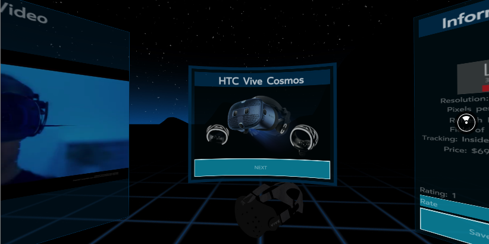

# VR-Systems-Guide

[Live Demo](http://vr-systems-guide.surge.sh/)

## Description

### Functional Description
The purpose of this app is to give an overview of the current most popular VR Headsets. Basic technical specification is provided alongside an official commerial video.
The user is able to rate the headsets of interest.

### Technical Description
- **React360** is used in this application for the front-end.

-  **AWS S3** is used to store the videos and images.

- The API calls are made to a **PostgreSQL database**.

- A **Node.js/Express** server with routers handles the endpoints.

## Setup

1. Clone this repository

2. In the terminal, change to the directory on your computer that contains this repo

3. Install dependencies: `npm install`

4. Start the app in a web browser: `npm start`

## Usage
1. Works in any common desktop browser. Use the mouse to navigate.
2. Works on Android devices.
3. Known Issue: Video and audio do not work on iOS devices.
4. As a full VR app, it works with the Supermedium browser:
  - Install Supermedium on SteamVR - https://store.steampowered.com/app/803010/Supermedium__Virtual_Reality_Browser/
  - Install Supermedium on Oculus devices - https://www.oculus.com/experiences/rift/1629560483789871/
  - Inside Supermedium add the web page to favorites to open. 
